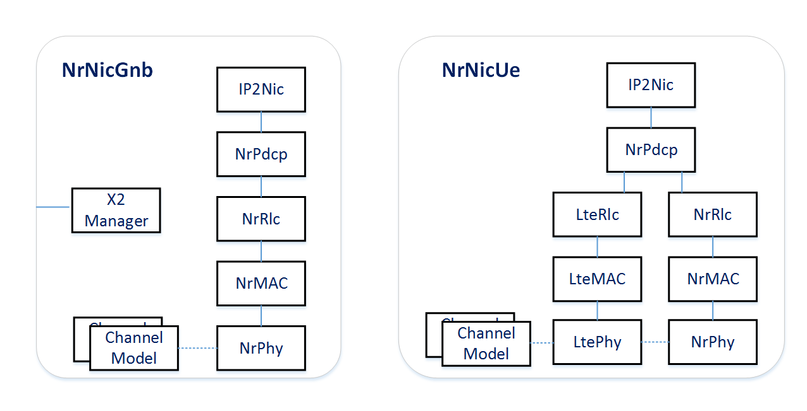
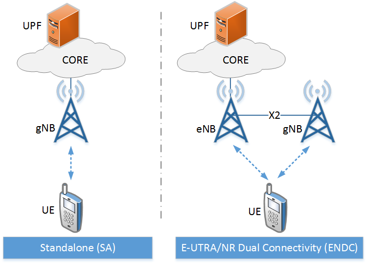
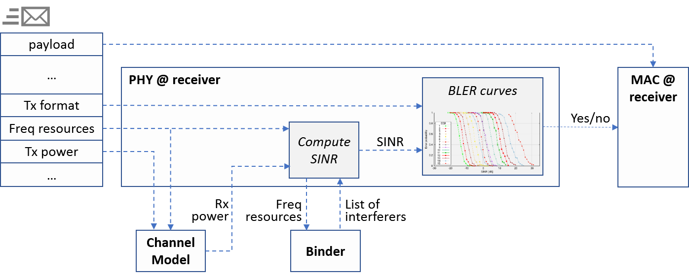

Overview
========

Features
--------

Simu5G is a 5G New Radio (NR) simulator based on the well-known
`SimuLTE <https://simulte.omnetpp.org/>`__ library, developed by
the same :doc:`research group <contacts>` and widely used by
industry and academia. Simu5G is based on the OMNeT++
simulation framework, and provides a collection of models with
well-defined interfaces, which can be instantiated and
connected to build arbitrarily complex simulation scenarios.
Simu5G incorporates all the models from the INET library, which
allows one to simulate generic TCP/IP networks including 5G NR
layer-2 interfaces. In particular, Simu5G simulates the data
plane of the 5G RAN (rel. 16) and core network. It allows
simulation of 5G communications in both Frequency Division
Duplexing (FDD) and Time Division Duplexing (TDD) modes, with
heterogeneous gNBs (macro, micro, pico etc.), possibly
communicating via the X2 interface to support handover and
inter-cell interfer-ence coordination. Dual connectivity
between an eNB (LTE base station) and a gNB (5G NR base
station) is also available. 3GPP-compliant protocol layers are
provided, whereas the physical layer is modelled via realistic,
customizable channel models. Resource scheduling in both uplink
and downlink directions is supported, with support for Carrier
Aggregation and multiple numerologies, as specified by the 3GPP
standard (3GPP TR 38.300, TR 38.211). Simu5G supports a large
variety of models for mobility of UEs, including vehicular
mobility.

Simu5G allows one to code and test, for instance, resource
allocation and management schemes in 5G networks, e.g.
selecting which UEs to target, using which modulation scheme,
etc., taking into account inter-cell interference coordination,
carrier selection, energy efficiency and so on. Moreover,
Simu5G can be run in :doc:`real-time emulation <users-guide/emulation>`
mode, enabling interaction with real devices, thanks to
OMNeT++'s real-time scheduling of events and INET's capability
to exchange IP packets between local applications or network
interfaces and the simulator. These IP packets are processed by
the simulator as if they were traversing the 5G cellular
network. The above two features concur to allow a user to run
live networked applications having an emulated 5G network in
the middle, using the same codebase for both simulations and
live prototyping.

Simu5G also includes a :doc:`model of ETSI MEC <users-guide/MEC>`,
complete with models of MEC orchestrator, MEC platforms, MEC
hosts and MEC services. In the latter, interfaces towards
application endpoints (MEC app and Device app) are ETSI
compliant, which means that one can also use real MEC-based
applications and run them through a simulated 5G network, also
in real time. Our MEC model comes with MEC services, namely the
Radio Network Information Service and the Location Service,
which return information taken from the simulated 5G network.
This way a MEC developer can test real MEC applications in a
realistic and fully controllable MEC-enabled 5G network.

Nodes
-----

**UEs** and **gNBs** are implemented as compound modules. These
can be connected with each other and with other nodes (e.g.
routers, applications, etc.) in order to compose networks. The
UEs and gNBs are further composed of modules:

-  *TCP* and *UDP* applications (any INET compatible
   application)
-  *TCP* and *UDP* transport layers (from INET)
-  *IP* layer (from INET)
-  *NR NIC* implementing the NR stack at both the gNB and UE.
   The stack includes all the sublayers (PDCP, RLC, MAC, PHY).
   At the UE, a dual stack is implemented to allow coexistence
   between 4G (LTE) and 5G (NR)

.. figure:: images/architecture.png
   :align: center
   :figwidth: 70%
   
A **Binder** module is visible by every other node in the
system and stores information about them, such as references to
nodes. It is used, for instance, to locate the interfering gNBs
in order to compute the inter-cell interference perceived by a
UE in its serving cell.

Deployments
-----------

Simu5G supports both StandAlone (SA) and E-UTRA/NR Dual
Connectivity (ENDC) deployment. where LTE and 5G coexist (3GPP
– TR 38.801). In the ENDC configuration, the gNB works as a
Secondary Node (SN) for an LTE eNB, which acts as Master Node
(MN) and is connected to the Core Network. the LTE eNB model is
imported from `SimuLTE <https://simulte.omnetpp.org>`__, with which
Simu5G is fully compatible. The eNB and the gNB are connected
through the X2 interface and all NR traffic needs to go through
the eNB. According to (3GPP - TR 37.340), the data flow between
the eNB and the gNB is shown below. Data destined to a UE
served by the eNB (Master Cell Group – MCG - bearer) follows
the LTE protocol stack, whereas data destined to a UE served by
the gNB (Secondary Cell Group – SCG - bearer) gets into the NR
PDCP entity at the eNB and is transferred to its peering NR RLC
entity in the gNB, via the X2 interface. The 3GPP standard also
supports Split Bearers (SBs). With this feature, data belonging
to the same connection can traverse either the eNB or the gNB.
The PDCP layer at the UE side will then reorder PDUs coming
from LTE/NR RLC layers.

.. figure:: images/dual_stack.png
   :align: center
   :figwidth: 80.0%

NR resource management
----------------------

Simu5G currently supports:

-  **Carrier Aggregation (CA):** a global carrierAggregation
   module stores all the information related to the CCs
   employed in the network. It includes a vector of N
   ComponentCarrier submodules, whose carrier frequency can be
   configured via NED/INI. A gNB/UE may be restricted to use
   only a subset of the available CCs.
-  **Different numerologies:** as with LTE, a NR radio frame is
   10 ms long and consists of 10 subframes, each having 1ms
   duration. However, NR subframes are further divided into up
   to 14 slots, which are the NR TTIs. A numerology index
   defines the slot duration, and UEs are scheduled in slots.
   In Simu5G, a different numerology can be associated to each
   CC and configured via NED/INI. gNBs and UEs can be limited
   to only a subset of numerologies.
-  **Frequency/Time Division Duplexing (FDD/TDD):** Simu5G
   supports both FDD and TDD. In FDD, each CC has separate
   portions for UL and DL spectra. As far as TDD is concerned,
   NR foresees 62 possible slot formats (3GPP - TR 38.213),
   where individual symbols in a slot can be DL, UL or flexible
   (i.e., it can be assigned dynamically to DL or UL
   transmissions, or kept idle). We model TDD slot formats as
   properties of the CC, and we associate the slot format to
   the componentCarrier submodules. In the current version of
   Simu5G, flexible symbols are used as guard symbols. However,
   the above modeling allows one to easily design policies to
   assign flexible symbols to DL or UL dynamically.

Physical layer modeling
-----------------------

The architecture of the PHY module in Simu5G mirrors the one of
`SimuLTE <https://simulte.omnetpp.org>`__, and is shown below. 

When a MAC PDU is sent from a sender to a receiver, an OMNeT++
message is exchanged between them. On receipt of the latter,
the receiver applies a channel model to compute the received
power. The channel model can be configured to incorporate
fading, shadowing, pathloss, etc., and can be made arbitrarily
complex. From the received power, the receiver computes the
SINR, querying the Binder to know which other nodes were
interfering on the same resources. Then, it leverages Block
Error Rate (BLER) curves to compute the reception probability
for each RB composing the ongoing transmission. This makes it
possible to translate a SINR and a transmission format to a
probability of correct reception of the entire MAC PDU. The
above modelling abates the computational complexity of the
decoding operation, hence the simulation running time, while
preserving its correctness.

In Simu5G, each MAC TB is encapsulated within an AirFrame
message and sent to the destination module, which applies the
model of the air channel to decide whether the AirFrame is
received successfully or not. Since a MAC TB is associated with
a given CC, the corresponding AirFrame is subjected to channel
effects (e.g. path loss, shadowing etc.) that depend on that
CC. This means that different channel models have to be applied
to compute the SINR at the receiving side. For this reason,
each gNB/UE is equipped with a vector of channelModel modules,
and each of them is associated with one of the CCs available in
the carrierAggregation module.

Simu5G's PHY model has been validated in compliance with the
guidelines reported in `3GPP -
RP-180524 <https://www.3gpp.org/ftp/tsg_ran/TSG_RAN/TSGR_79/Docs/RP-180524.zip>`__.
In particular, in the Urban Macro (UMa) scenario with 57 cells,
30 UEs described in Table 4, config. A of the above document,
the SINR distribution obtained with Simu5G matches the
reference one perfectly, as shown in the figure below.

.. figure:: images/SINR.png
   :align: center
   :figwidth: 70.0%

