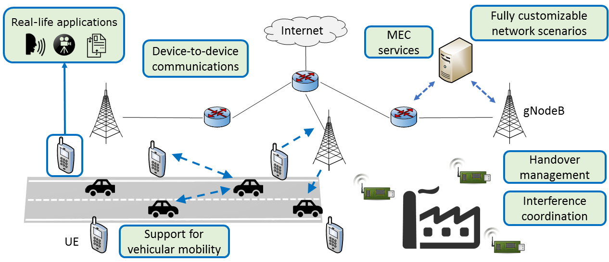

:hero: 5G New Radio User Plane Simulation Model for INET & OMNeT++

Simu5G: Simulator for 5G New Radio Networks
===========================================

Simu5G is the evolution of the popular `SimuLTE 4G network simulator <https://simulte.omnetpp.org>`__
that incorporates 5G New Radio access.
Based on the OMNeT++ framework, it is written in C++ and is
fully customizable with a simple pluggable interface. One can
also develop new modules implementing new algorithms and
protocols.

Using Simu5G
------------

The idea behind Simu5G is to let researchers simulate and
benchmark their solutions on an easy-to-use framework. It
borrows the concept of modularity from OMNeT++ thus it is
easy to extend. Moreover it can be integrated with other
modules from the INET Framework. It offers support to
optimization tools (e.g. optimization solvers such as CPLEX).
Simu5G is compatible with
`SimuLTE <https://simulte.omnetpp.org/>`__, and allows one to
simulate network scenarios where 4G and 5G coexist, in both
StandAlone (SA) and E-UTRA/NR Dual Connectivity (ENDC)
deployments. Furthermore, it inherits SimuLTE's compatiblity
with other OMNeT++-based libraries, for instance Veins for
vehicular mobility.

System Requirements
-------------------

Simu5G can be used on any system compatible with OMNeT++
(Windows, Linux or macOS). See
`OMNeT++ <https://omnetpp.org/>`__ page for more info.
Simu5G requires:

-  OMNeT++ v6.0.x
-  INET-Framework v4.5.x

For more information and installation instructions, see the
:doc:`install`.

Main Features
-------------

+-----------------------+-----------------------+--------------------------+
| **User Terminals:**   | **g-NodeB:**          | **Network emulation:**   |
|                       |                       |                          |
| Mobility;             | Macro, micro, pico    | Simu5G can also run      |
| Interference; all     | gNBs; SA and ENDC     | as a :doc:`network       |
| types of traffic;     | deployments; Carrier  | emulator                 |    
| handover;             | Aggregation; TDD/FDD  | <users-guide/emulation>`,|
| network-assisted D2D  | with numerologies;    | integrating an           |
| communications        | support for handover; | emulated 5G network      |
|                       | Scheduling            | with real networks       |
|                       | algorithms: Max C/I,  | and applications.        |
|                       | Proportional Fair,    |                          |
|                       | Round Robin, etc.     |                          |
+-----------------------+-----------------------+--------------------------+
| **RLC:**              | **MAC:**              | **PHY:**                 |
|                       |                       |                          |
| UM and AM;            | Buffering; PDU        | H-ARQ; channel           |
| segmentation and      | concatenation; CQI    | feedback computation;    |
| reassembly;           | reporting and         | realistic channel        |
| retransmissions (AM   | reception; transport  | models associated to     |
| only).                | format selection and  | CCs; correct             |
|                       | resource allocation;  | reception based on       |
|                       | Coding designed to    | SINR and BLER curves.    |
|                       | facilitate            |                          |
|                       | cross-layer analysis. |                          |
+-----------------------+-----------------------+--------------------------+
| :doc:`ETSI MEC <users-guide/MEC>`:                                       |
|                                                                          |
| Model of both MEC system-level and host-level entities:                  |
| UALCMP, MEC                                                              |
| orchestrator, MEC host, MEC platform, MEC services. Radio                |
| Network Information and Location Services are implemented.               |
| Fully compliant ETSI interfaces towards Device app and MEC               |                                       
| app allow one to use real MEC application endpoints with 5G              |                                         
| transport and MEC services based on information coming from the 5G       |
| network.                                                                 |
+--------------------------------------------------------------------------+

Core contributors and funding
-----------------------------

Simu5G is the result of a joint research project carried
out by Intel Corporation and the `Computer Networking
Group <http://cng1.iet.unipi.it/wiki/index.php/Main_Page>`__
of the University of Pisa, Italy.
UniPi team:

-  Giovanni Nardini
   (`webpage <http://docenti.ing.unipi.it/g.nardini>`__)
-  Giovanni Stea
   (`webpage <http://docenti.ing.unipi.it/g.stea/>`__)
-  Antonio Virdis
   (`webpage <http://docenti.ing.unipi.it/a.virdis>`__)

.. toctree::
   :caption: Home
   :hidden:

   Introduction <self>
   description
   install
   faq
   related
   contacts

.. toctree::
   :hidden:

   users-guide/index

.. toctree::
   :hidden:

   showcases/index

.. toctree::
   :hidden:

   tutorials/index
