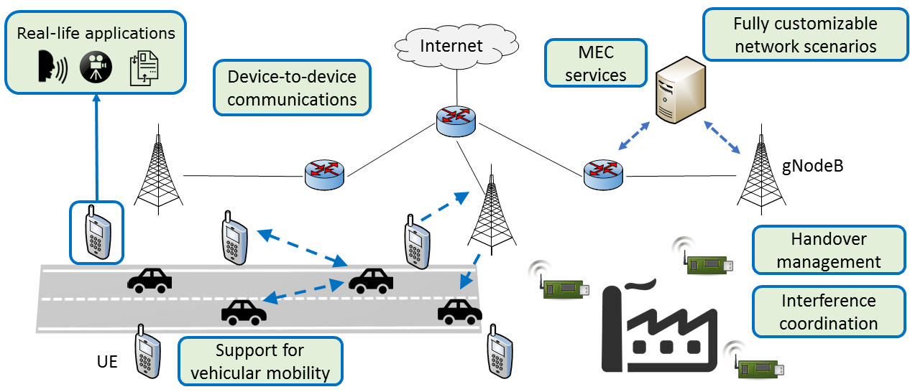

:hide-navigation:
:hide-footer:

.. toctree::
   :caption: Home
   :hidden:

   self

.. toctree::
   :caption: Documentation
   :hidden:

   doc

.. toctree::
   :hidden:

   install

.. toctree::
   :hidden:

   Releases <https://github.com/Unipisa/Simu5G/releases>

.. toctree::
   :caption: FAQ
   :hidden:

   faq

.. toctree::
   :hidden:

   related

.. toctree::
   :hidden:

   contacts

Simu5G: Simulator for 5G New Radio Networks
===========================================

Simu5G is the evolution of the popular `SimuLTE 4G network simulator
<https://simulte.omnetpp.org>`__ that incorporates 5G New Radio access. Based
on OMNeT++ and the INET Framework, it is written in C++ and is fully
customizable with a simple pluggable interface. One can also develop new
modules implementing new algorithms and protocols.

Using Simu5G
------------

The idea behind Simu5G is to let researchers simulate and benchmark their
solutions on an easy-to-use framework. It borrows the concept of modularity
from OMNeT++, thus it is easy to extend. Moreover, it can be integrated with
other modules from the INET Framework, and with other OMNeT++-based libraries,
for instance Veins for vehicular mobility.

Simu5G contains the LTE models of SimuLTE, and allows one to simulate network
scenarios where 4G and 5G coexist: 5G standalone (SA) deployments, as well as
E-UTRA/NR (EN-DC) and NR/E-UTRA (NE-DC) Dual Connectivity deployments.

System Requirements
-------------------

Simu5G can be used on any system supported by OMNeT++ and the INET Framework
(Linux, macOS or Windows). The OMNeT++ and INET versions a Simu5G release was
tested with, and is compatible with, are listed in that release's entry in the
`release notes <https://github.com/Unipisa/Simu5G/blob/master/WHATSNEW.md>`__.

For installation instructions, see the :doc:`install` page.

Main Features
-------------

+-----------------------+------------------------+---------------------------+
| **User Terminals:**   | **eNodeB/gNodeB:**     | **Network emulation:**    |
|                       |                        |                           |
| Mobility;             | Macro, micro, pico     | Simu5G can also run as a  |
| interference; all     | cells; Carrier         | :doc:`network emulator    |
| types of traffic;     | Aggregation; FDD and   | <users-guide/emulation>`, |
| handover; LTE, NR and | TDD with multiple      | integrating an emulated   |
| dual-stack UEs;       | numerologies; X2       | 5G network with real      |
| network-assisted D2D  | interface; handover;   | networks and              |
| communications        | CoMP coordinated       | applications.             |
| (research prototype)  | scheduling             |                           |
+-----------------------+------------------------+---------------------------+
| **Bearers and QoS:**  | **RRC:**               | **Dual Connectivity:**    |
|                       |                        |                           |
| Data radio bearers    | Bearer management;     | EN-DC and NE-DC           |
| configured centrally, | handover; radio link   | deployments; split        |
| established up front  | failure and RRC        | bearers with configurable |
| or on demand;         | re-establishment. RRC  | uplink split and leg      |
| EPC-style packet      | functionality is       | selection; MCG and SCG    |
| filters and 5GC QoS   | modeled, RRC signaling | bearers                   |
| flows; SDAP with QoS  | is not simulated.      |                           |
| flow classification   |                        |                           |
| and reflective QoS;   |                        |                           |
| QCI/5QI QoS profiles  |                        |                           |
+-----------------------+------------------------+---------------------------+
| **RLC:**              | **MAC:**               | **PHY:**                  |
|                       |                        |                           |
| TM, UM and AM per TS  | HARQ; AMC and CQI      | Channel feedback          |
| 38.322 (NR) and TS    | reporting; random      | computation; stochastic   |
| 36.322 (LTE);         | access with preamble   | channel models per 3GPP   |
| segmentation and      | collisions; buffer     | TR 36.814, TR 36.873 and  |
| reassembly;           | status reporting per   | TR 38.901; reception      |
| retransmissions and   | logical channel group; | based on SINR and BLER    |
| status reporting (AM  | scheduling algorithms: | curves; background cells  |
| only)                 | Max C/I, Proportional  | for large-scale scenarios |
|                       | Fair, Deficit Round    |                           |
|                       | Robin, QoS-aware       |                           |
|                       | Proportional Fair,     |                           |
|                       | etc.                   |                           |
+-----------------------+------------------------+---------------------------+
| :doc:`ETSI MEC <users-guide/mec>`:                                         |
|                                                                            |
| Model of both MEC system-level and host-level entities: UALCMP, MEC        |
| orchestrator, MEC host, MEC platform, MEC services. Radio Network          |
| Information and Location Services are implemented. Fully compliant ETSI    |
| interfaces towards Device app and MEC app allow one to use real MEC        |
| application endpoints with 5G transport and MEC services based on          |
| information coming from the 5G network.                                    |
+----------------------------------------------------------------------------+

Development Since v1.3
----------------------

Starting with v1.3.1, Simu5G has been going through a thorough overhaul
(development repository: `inet-framework/Simu5G
<https://github.com/inet-framework/Simu5G>`__). The goals are to make the model
follow the 3GPP architecture more closely, to bring the code base in line with
the practices of the INET Framework, and thereby to build a sound foundation
for new protocol features. The work proceeds in small steps, each validated
with fingerprint, statistical and unit tests; where a change alters simulation
results, the release notes say so and explain why. The main milestones so far:

- **v1.4.0 - v1.4.2**: source tree and naming reorganized, more type-safe C++
  code, packets made inspectable.

- **v1.4.3 - v1.4.5**: bearers established explicitly instead of being
  discovered from the traffic, protocol state carried in real header fields
  instead of packet tags, explicit initialization stages, incomplete MIMO code
  removed; bugs fixed in the PHY error model, the MAC and MEC.

- **v1.5.x**: Control Plane functionality collected into an RRC compound
  module (bearer management, registration, handover control); PDCP and RLC
  rebuilt as per-bearer entity modules; SDAP and QoS flows added.

- **v1.6.0**: standards-based RLC Unacknowledged and Acknowledged Mode for both
  NR (TS 38.322) and LTE (TS 36.322); radio link failure detection and RRC
  re-establishment.

- **v1.7.0**: central, spec-modeled bearer and QoS-flow configuration (the
  ``BearerConfigurator`` module); SDAP on by default in 5G standalone networks;
  NE-DC and SCG bearers; buffer status reporting and uplink scheduling per
  logical channel group; D2D factored out into a separate, optional package;
  the 3GPP propagation formulas audited, fixed and covered by unit tests.

Many of these releases require changes to existing ini files, or to code that
extends Simu5G. The `release notes
<https://github.com/Unipisa/Simu5G/blob/master/WHATSNEW.md>`__ describe the
changes and the necessary porting steps for each release.

Core Contributors and Funding
-----------------------------

Simu5G is the result of a joint research project carried out by Intel
Corporation and the `Computer Networking Group
<http://cng1.iet.unipi.it/wiki/index.php/Main_Page>`__ of the University of
Pisa, Italy. UniPi team:

-  Giovanni Nardini
   (`webpage <http://docenti.ing.unipi.it/g.nardini>`__)
-  Giovanni Stea
   (`webpage <http://docenti.ing.unipi.it/g.stea/>`__)
-  Antonio Virdis
   (`webpage <http://docenti.ing.unipi.it/a.virdis>`__)

Since v1.3.1, Simu5G has been developed by Andras Varga and the `OMNeT++
<https://omnetpp.org>`__ core team. Notable contributions were also made by
Mohamed Seliem (University College Cork; initial SDAP code and QoS-aware
scheduling) and Esteban Egea Lopez (Universidad Politécnica de Cartagena; NR
RLC). The release notes credit contributions release by release.
