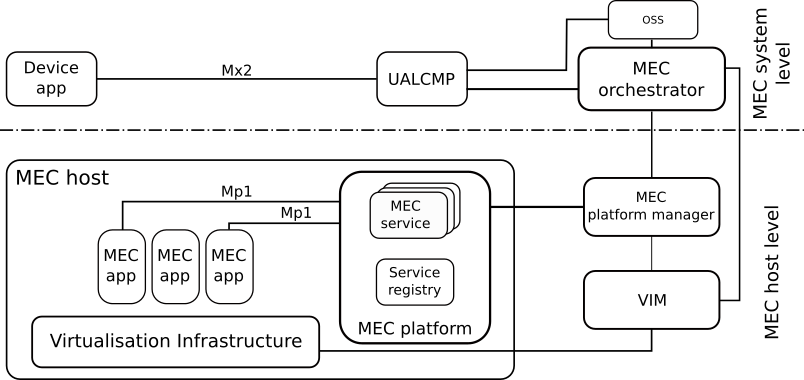
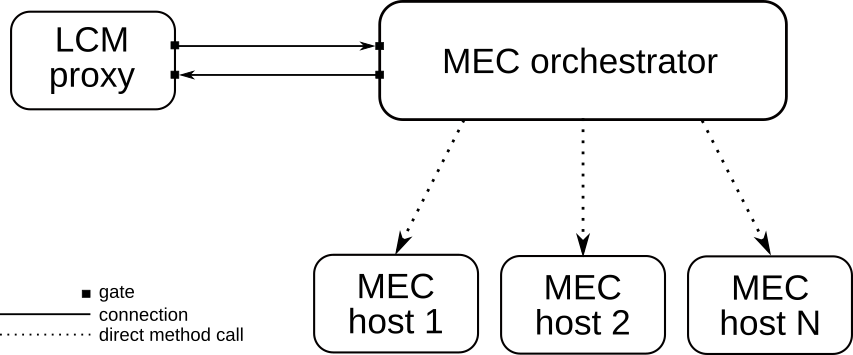
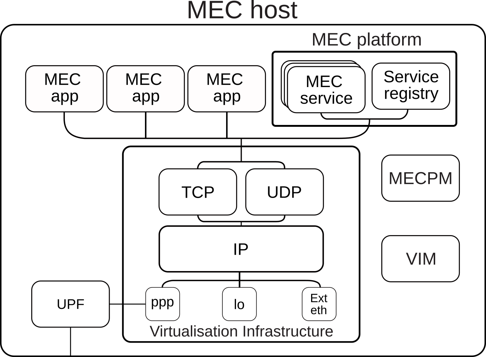
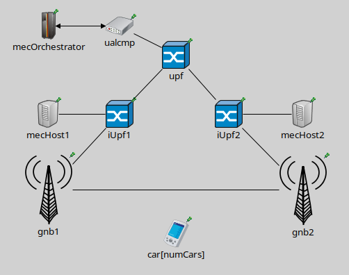
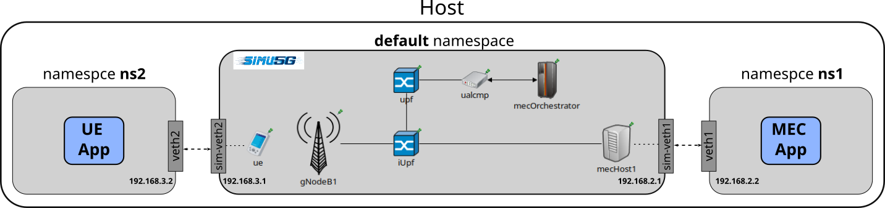

ETSI MEC model in Simu5G
========================

Simu5G includes a model of ETSI Multi-Access Edge Computing
(MEC). Our MEC model aims to provide MEC developers a tool for
rapid prototyping of MEC apps, which can exploit MEC services
made available by Simu5G. Application endpoints (e.g. Mp1 and
Mx2 interfaces) and MEC service communication are implemented
according to ETSI specifications. Since Simu5G can run as a
real-time network emulator, one can also interface real MEC
apps with it. This way, one can test MEC apps in a
computation/communication framework that includes 5G transport,
a MEC infrastructure, and the MEC services provided by the
former to the latter.

MEC system-level modeling
-------------------------

   
   MEC system-level model

At the system level, we model the LCM proxy and the MEC
orchestrator. The LCM proxy is a compound module including the
TCP/IP stack and one application module that provides the
RESTful API consumed by the Device app (either internal or
external to the simulator, through an INET external interface)
to trigger instantiation and termination of MEC apps via the
Mx2 reference point. The MEC orchestrator is a simple module
connected to the LCM proxy via gates. In scenarios with
multiple MEC systems, the MEC orchestrator manages a subset of
the MEC hosts in the simulation, specified through the
mecHostsList parameter, which is a space-separated string
specifying the names of the MEC hosts under its control. Upon
receiving a MEC app instantiation request from the LCM proxy
(which in turn receives the request by a Device app), the MEC
orchestrator selects the most suitable MEC host among those
associated with its MEC system, according to the MEC app
requirements. The latter are specified in the so-called
AppDescriptor JSON file and can include a list of required MEC
services and/or computing resources (RAM, CPU and disk), which
are checked against the available resources of the MEC hosts.

   MEC orchestrator

Once the MEC host has been identified, the MEC orchestrator
triggers the MEC app instantiation, by dynamically creating the
OMNeT++ module running the application logic and marking the
required MEC host resources as allocated. The Device app is
usually embedded in the UE client. However, its functions are
quite standard, i.e., managing instantiation/termination of MEC
apps by interfacing with the LCM proxy. For this reason, our
MEC model includes a basic Device app able to query the LCM
proxy via the RESTful API and communicating with the UE app
over an UDP socket by means of a simple interface including
messages for creation, termination and related acknowledgments
regarding a MEC app. This way, a user only needs to code the
data-plane colloquium between the UE app and the MEC app, as
well as their logic.

MEC host-level modeling
-----------------------

The MEC host module models the MEC host level of the MEC
architecture. It is configurable (via NED/INI files) with a
maximum amount of resources, i.e. RAM, storage and CPU, that
can be allocated to MEC apps. Its main components are the
Virtualisation Infrastructure Manager (VIM) and the MEC
platform modules. Communications with the MEC platform can also
involve real MEC apps when Simu5G runs as an emulator. For this
reason, all the entities, i.e. MEC service and Service
Registry, implement a RESTful HTTP server as a TCP application
running on top of the TCP/IP protocol stack of the
Virtualisation Infrastructure. Our model provides a module
called MecServiceBase, which implements all the non-functional
requirements needed for running an HTTP server (e.g. queueing,
TCP connection management, gNB connections etc.). This allows
the user to rapidly deploy an ETSI-compliant MEC service by
only implementing the HTTP methods (e.g. GET, POST) according
to the service behavior.

   MEC host level model

Two ETSI MEC services are currently implemented: Radio Network
Information service (RNIS), that allows users to gather
up-to-date information regarding radio network condition and
the UEs connected to the base station associated to the MEC
host, and the Location service, that provides accurate
information about UEs and/or base station locations, enabling
active device location tracking and location-based service
recommendations. The ServiceRegistry module implements the REST
resources – and HTTP methods – needed to allow MEC apps to
discover MEC services via the Mp1 reference point. MEC apps are
deployed as applications over TCP and UDP transport-layer
protocols of the Virtualisation Infrastructure compound module.
Allocated resources are used by the VIM to compute the delay
used to model processing time: the CPU constraint is expressed
in terms of instructions per second, so that we can model the
processing time of a MEC app, i.e. the time required by the MEC
app to execute a set of instructions, based on the MEC host
processing speed and load. A MEC host also has an UPF module
that allows it to be placed anywhere in the CN of the 5G
network. This is useful, for example, to test different MEC
host deployments.

Deployment scenarios
--------------------

As already mentioned, Simu5G can run in both simulated and
emulated mode. So, the user can develop and test MEC-related
applications in either mode, according to her needs. For
instance, it could be the case that only a real MEC app should
be tested, leaving the UE application as a stub method inside
the simulator, possibly because its behavior is not needed or
it is not yet available. We report below the configurations
required to run some MEC scenarios in both Simu5G execution
modes.

Running a fully simulated system
~~~~~~~~~~~~~~~~~~~~~~~~~~~~~~~~

   Simulated network

The simulated MEC system contains a LCM proxy, a MEC
orchestrator and two MEC hosts, namely mecHost1 and mecHost2,
that are associated to a gNB. Car is a vector of UEs, each of
them running an application called UEWarningAlertApp. The
latter instantiates a MEC app named MECWarningAlertApp, which
is supposed to be onboarded in the MEC system during network
initialization and to send alert messages to cars when they
enter a danger zone. Cars also run the Device app responsible
for requesting the MEC app instantiation to the LCM proxy on
behalf the UEs. Besides the module implementing the logic of
the MECWarningAlertApp, an AppDescriptor is also required:

.. code:: json

   {
      "appID" : "WAMECAPP",
      "appName" : "MECWarningAlertApp",
      "appProvider" : "simu5g.apps.mec.WarningAlert.MECWarningAlertApp",
      "virtualComputeDescriptor" :{
         "virtualDisk" : 10,
      "virtualCpu" : 1500,
      "virtualMemory" : 10
      },
      "appServiceRequired" : [{
      "ServiceDependency" :{
         "serName" : "LocationService",
         "version" : "v2",
         "serCategory" : "Location"
      }
      }],
   }

The MEC app requires 10 MB of RAM, 10 MB of storage, 1500
instructions per second of CPU and it consumes the Location
Service. Next, it is necessary to configure both the car[*]
modules and the MEC entities.

.. code:: ini

   ############ MEC Configuration ############
   # MEC Hosts
   **.mecHost*.virtualisationInfrastructure.ipv4.forwarding = true
   *.mecHost*.maxMECApps = 100     # max ME Apps to instantiate
   *.mecHost*.maxRam = 32GB            # max KBytes of Ram 
   *.mecHost*.maxDisk = 100TB      # max KBytes of Disk Space 
   *.mecHost*.maxCpuSpeed = 400000             # max CPU
   *.mecHost*.bsList = "gnb1, gnb2"

   # MEC host 2 services configurations
   *.mecHost2.mecPlatform.numMecServices = 1
   *.mecHost2.mecPlatform.mecService[0].typename = "LocationService"
   *.mecHost2.mecPlatform.mecService[0].localAddress = "mecHost2.virtualisationInfrastructure" 
   *.mecHost2.mecPlatform.mecService[0].localPort = 10020
   *.mecHost2.mecPlatform.serviceRegistry.localAddress = "mecHost2.virtualisationInfrastructure" 
   *.mecHost2.mecPlatform.serviceRegistry.localPort = 10021

   # MEC Orchestrator configuration
   *.mecOrchestrator.mecHostList = "mecHost1, mecHost2"              # MEC hosts associated to the MEC system

   *.mecOrchestrator.mecApplicationPackageList = "WarningAlertApp"   # List of MEC app descriptors to be onboarded at init
   *.mecHost*.mecPlatformManager.mecOrchestrator = "mecOrchestrator" # the MECPM needs to know the MEC orchestrator
      
   #------------UEWarningAlertApp---------------
   *.car[*].numApps = 2

   # app[0] is the Device App
   *.car[*].app[0].typename = "DeviceApp"
   *.car[*].app[0].localPort = 4500
   *.car[*].app[0].UALCMPAddress = "ualcmp"
   *.car[*].app[0].UALCMPPort = 1000
   #optional if the Appdescriptor is not already onboarded (see *.mecOrchestrator.mecApplicationPackageList par)
   *.car[*].app[0].appPackageSource = "ApplicationDescriptors/WarningAlertApp.json"

   # app[1] is the UE App
   *.car[*].app[1].typename = "UEWarningAlertApp"

   # Device App address and port
   *.car[*].app[1].destAddress = "car["+string(ancestorIndex(1))+"]"
   *.car[*].app[1].destPort = 4500
      

Both the MEC hosts have the same computational capacity, but
only mecHost2 has a Location Service running on its MEC
platform, hence it will be the one chosen by the MEC
orchestrator to deploy the MEC app.
If the user wanted to request the onboarding of the
appDescriptor file from the Device app, instead of it being
loaded at initialization time, it has to insert the path to the
file in the appPackageSource parameter of the Device app and
remove the appDescriptor file name from the list of the MEC
orchestrator mecApplicationPackageList parameter.

The described example is available in the simulation folder in
Simu5G
(`here <https://github.com/Unipisa/Simu5G/tree/master/simulations/NR/mec/multiMecHost>`__),
so you can look at it to have the view of the complete
configuration.

Running an emulated system
~~~~~~~~~~~~~~~~~~~~~~~~~~

We now describe the configuration required to run a MEC system
in emulation mode within Simu5G. More in detail, the following
operations will be highlighted: routing rules, in both the
simulator and the host running the real applications, and the
configuration to instruct the MEC orchestrator to manage the
instantiation of a real MEC app. In this example, both the UE
app and the MEC app are real applications running on the same
host where Simu5G runs. The real applications replicate the
behavior described in the fully simulated example above and the
5G scenario includes one UE, i.e the car, and one MEC host. The
Device app runs inside the UE and communicates with the real UE
app through the serialization and deserialization of the
messages feature offered by the OMNeT++ platform.

| The interaction with the real world occurs via two INET’s
   ExtLowerEthernetInterface modules included into the car and
   mecHost modules. Such interfaces can receive real packets by
   network interface cards attached to them. In our case, these
   network interfaces are created as Virtual Ethernets
   (`veth <https://man7.org/linux/man-pages/man4/veth.4.html>`__)
   inside different `Linux
   namespaces <https://man7.org/linux/man-pages/man7/namespaces.7.html>`__,
   i.e ns1 for the MEC app, ns2 for the UE app and the default
   one where Simu5G runs.
| The figure below describes the setup:

   Namespaces

| Data packets directed to the simulator are routed to the
   relative sim-veth interface attached to the
   ExtLowerEthernetInterface modules.
| The INI configuration of the ExtLowerEthernetInterface
   modules to allow the communication with the real world is:

.. code:: ini

   ############## Ext Interface configuration ##############
   # equip the MEC host and UE with an External Ethernet interface 
   *.mecHost1.virtualisationInfrastructure.numExtEthInterfaces = 1
   *.mecHost1.virtualisationInfrastructure.extEth[0].typename = "ExtLowerEthernetInterface"
   *.mecHost1.virtualisationInfrastructure.extEth[0].device = "sim-veth1"
   *.mecHost1.virtualisationInfrastructure.ipv4.forwarding = true
   
   *.ue.numEthInterfaces = 1
   *.ue.eth[0].typename = "ExtLowerEthernetInterface"
   *.ue.eth[0].device = "sim-veth2"
   *.ue.extHostAddress = "192.168.3.2"
   *.ue.ipv4.forwarding = true

As far as the MEC system is concerned, to allow the
instantation of a real MEC app in the appDescriptor file
related to a real MEC app, a field called
emulatedMecApplication must be inserted. The latter contains
the ipAddress and port sub-fields identifying the real MEC app
endpoint. This way, the MEC orchestrator is made aware that the
MEC app to instantiate is running outside Simu5G and it does
not need to request the creation of the MEC app module inside
the simulator. Then, the MEC orchestrator communicates to the
Device app the IP-port pair the UE app will need to use to
communicate with the MEC app, i.e. 192.168.2.2 in this example.

Once the Simu5G environment is configured, the OS of the host
running all the applications must be configured, too. The
following commands refers to a host equipped with Linux Ubuntu
18.04 OS.
Linux namespaces are created with the following commnad:

.. code:: shell

   sudo ip netns add ns1
   sudo ip netns add ns2

veth interfaces are created by the following command:

.. code:: shell

   # create virtual ethernet link: ns1.veth1 <--> sim-veth1 
   sudo ip link add veth1 netns ns1 type veth peer name sim-veth1
   # create virtual ethernet link: ns2.veth2 <--> sim-veth2 
   sudo ip link add veth2 netns ns2 type veth peer name sim-veth2

Then an IP address and a netmask is assigned to the veth
interfaces veth1 and veth2:

.. code:: shell

   # Assign the address 192.168.2.2 with netmask 255.255.255.0 to `veth1`
   sudo ip netns exec ns1 ip addr add 192.168.2.2/24 dev veth1
   # Assign the address 192.168.3.2 with netmask 255.255.255.0 to `veth2`
   sudo ip netns exec ns2 ip addr add 192.168.3.2/24 dev veth2

After bringing up all the new interfaces:

.. code:: shell

   sudo ip netns exec ns1 ip link set veth1 up
   sudo ip netns exec ns2 ip link set veth2 up
   sudo ip link set sim-veth1 up
   sudo ip link set sim-veth2 up

we need to add the default IP route within new namespaces

.. code:: shell

   sudo ip netns exec ns1 route add default dev veth1
   sudo ip netns exec ns2 route add default dev veth2

These are the main steps to being able to run an emulation of
Simu5G with the MEC framework. Read the `Building Simu5G for
real-time emulation <http://simu5g.org/emulation.html>`__
section to learn how to launch it. The described example is
available in the emulation folder in Simu5G
(`here <https://github.com/Unipisa/Simu5G/tree/master/emulation/mec/extUeAppMecApp>`__),
so you can look at it to have a complete view of both the
configuration and the setup.

