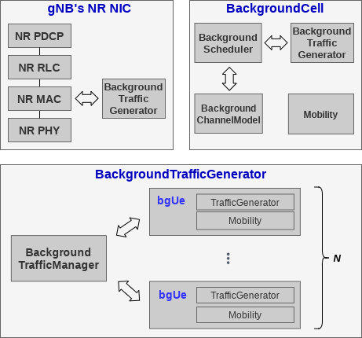
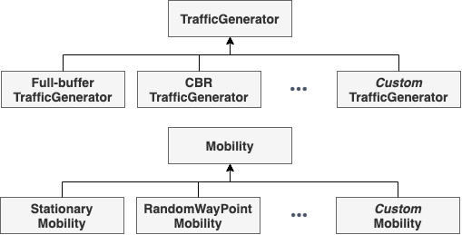
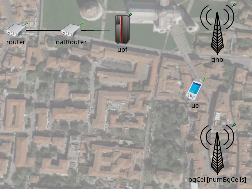

Running Simu5G as a real-time network emulator
==============================================

Running Simu5G as a network emulator means that the simulation
must run in real time and must be able to communicate with the
real world, i.e. capturing/injecting packets from/to real
networks. This is especially useful for integrating Simu5G with
external real-world applications and frameworks. For example,
it allows one to `make Simu5G interoperable with the Intel
OpenNESS framework <emulation_openness.html>`__.

Check out our PIMRC 2020 paper on this topic:

-  G. Nardini, G. Stea, A. Virdis, D. Sabella, P. Thakkar,
   "Using Simu5G as a Realtime Network Emulator to Test MEC
   Apps in an End-To-End 5G Testbed", PiMRC 2020, London, UK,
   1-3 September 2020

An emulation demo
-----------------

With reference to the video below, the "sender" PC on the left
sends 2.5kB packets to the "receiver" laptop on the right every
100ms, and the PC in the middle runs Simu5G as an emulator,
transporting packets between the two endpoints. On receipt of a
packet, the receiver sends back an ACK. TCP is used as a
transport protocol. The scenario emulated in Simu5G is
displayed on the middle screen, and it contains one UE (the red
dot) that moves away from its serving gNB (the triangle in the
central hexagon) and back again. Neighboring gNBs interfere on
the downlink spectrum. The deployment bandwdith is kept
artificially low, to saturate the radio frame. Within Simu5G,
the sender is connected to a remote server (not shown in the
picture) and the receiver is connected to the moving UE. The
sender screen displays a moving-window average of the
round-trip time (RTT) of the communication, measured at the
application layer. The RTT climbs up as the UE moves away from
the gNB, because its CQI goes down, hence more radio resources
are used for the same transmission, and then it climbs down
again as the UE moves back towards the gNB. Local delay spikes
can be observed, corresponding to H-ARQ retransmissions.

Large-scale real-time emulation with Simu5G
-------------------------------------------

Real-time emulation with Simu5G is possible thanks to:

-  the capabilities of the OMNeT++ environment to run a
   real-time event scheduler;
-  the capabilities of the INET library to exchange packets
   between a running simulation and the operating system.

Moreover, a careful modeling of Simu5G functionalities and
entities is required to make the software lightweight enough to
be executed in real-time on a desktop machine. We designed new
functionalities in Simu5G so as to allow it to run in real time
up to fairly large scales (i.e., ten cells, a thousand UEs),
which are required to create scenarios where realistic
intercell interference and resource contentions are emulated.
Our solution is to provide multiple models of the main network
elements (i.e., UEs and cells), representing different tradeoff
points between the level of detail and the processing overhead.
We distinguish between foreground (FG) and background (BG) UEs,
depending on their role within a simulation experiment. A FG UE
is one whose application packets and/or statistics you will
want to observe. In a FG UE, all the protocols must be modeled
(from the application to the PHY sublayer of the NR stack), and
PHY-layer reporting must be enabled. On the other hand, a BG UE
needs not have the full protocol stack and exists only for the
sake of creating resource contention at the MAC level and
interference. Thus, a BG UE basically consists of a traffic
generator and a mobility model.

Similarly, we distinguish FG and BG cells. A FG cell is one to
which at least one FG UE is associated, whereas a BG cell only
serves BG UEs. BG cells are employed to create interference to
FG cells.

A FG cell needs to perform all the operations required by all
the layers of the protocol stack including scheduling in both
the DL and the UL directions. On the other hand, a BG cell does
not need to implement the whole protocol stack and only needs
to determine which BG UEs occupies which RBs at the MAC layer.
Since the only tangible effect of BG UEs in both FG and BG’s
MAC layers is to affect the scheduling process at the gNB
itself, we choose to deploy them using a new module called
BackgroundTrafficGenerator within both FG and BG cells.

The figure below depicts the enhanced internal architecture of
the NR NIC of a FG cell and the new BackgroundCell model for
the BG cell, both including a BackgroundTrafficGenerator
submodule.

   NR NIC

The BackgroundTrafficGenerator includes:

-  a vector of modules representing a configurable number of BG
   UEs;
-  a BackgroundTrafficManager module that manages the
   interaction between the BG UEs and the gNB’s protocol stack.

In turn, each BG UE is composed of two submodules, namely
Mobility and TrafficGenerator. The former stores the position
of the BG UE in the network floorplan and manages its movement,
whereas the latter stores the size of the BG UE’s data buffer
according to some traffic generation pattern. Both Mobility and
TrafficGenerator can be extended through inheritance of OMNeT++
modules to configure the desired mobility pattern and traffic
generation distribution, as shown in the figure below.

   Class hierarchy

As far as the BackgroundCell module is concerned, the
BackgroundTrafficGenerator submodule described above represents
BG UEs under the control of such BG cell. Then, a module called
BackgroundScheduler takes care of allocating RBs in both UL and
DL directions. To accomplish that, it interacts with the
BackgroundTrafficGenerator to get the BG UEs’ buffers and
stores data structures relevant to the resource allocation.
Moreover, the BackgroundCellChannelModel deals with the
computation of SINR for the BG UEs according to the
configurable parameters provided by this module (e.g. carrier
frequency, transmission power and so on), whereas the Mobility
module stores the position of the BG cell in the floorplan.
Using this model, one can deploy the desired number of BG cells
in the floorplan and each of them can be configured with its
own channel model parameters and BG UEs.

Running an emulation example with Simu5G
----------------------------------------

.. note:: Emulation support has been introduced since Simu5G
   1.2.0. As per INET instructions, emulation is only available on
   Linux OS.

The Simu5G repository comes with three (single-machine)
emulation examples, which can be used as a basis to develop
your own emulation testbed. You can find the examples in the
following folders:

-  "emulation/extserver"
-  "emulation/extclientserver"
-  "emulation/extclientserver_bgTraffic"

Description and instructions for the examples can be found in
the README files included in the above folders.

Configuring the emulated scenario
---------------------------------

In the following, we refer to the scenario included in the
"emulation/extclientserver_bgTraffic" folder. The corresponding
network is depicted in the figure below: 

   Simulated network

In this example the network consists of one UE connected to one
gNB, one UPF, one NAT router, one router, one external (real)
server and one external (real) client. The external client
application (i.e. associated to the UE in the emulation) sends
10MB using TCP to the external server application, *traversing
the emulated 5G network*. The 5G network includes a
(configurable) number of background cells and background UEs.
IP addresses and routing tables are set up by using mrt files
(see "routing_files" folder).

The interaction with the real world occurs via two INET’s
ExtLowerEthernetInterface modules included into the *ue* and
*router* modules. Such interfaces can receive real packets by
network interface cards attached to them. In our case, such
network interfaces are created as Virtual Ethernets (*veth*).
Data packets directed to the simulator are routed to the
relative *veth* attached to the ExtLowerEthernetInterface
modules. Since all the applications run in the same host, the
*natRouter* module is used to bypass the host operating system
and steer the traffic towards the simulator. This way, both
real applications send packet to the IP addresses of the
*natRouter*, which in turn performs Network Address Translation
by changing the destination addresses to the proper real
application’s addresses. The INI configuration for the
*natRouter* router is:

.. code:: ini

   ############## natRouter configuration ##############
   *.natRouter.ipv4.natTable.config = xml("<config> \
            <entry type='prerouting' \
               packetDataFilter='*Ipv4Header and destAddress=~10.0.2.1' \
               srcAddress='10.0.3.2' destAddress='192.168.2.2'/> \
            <entry type='prerouting' \
               packetDataFilter='*Ipv4Header and destAddress=~10.0.3.2' \
               srcAddress='10.0.2.1' destAddress='192.168.3.2'/> \
            </config>")

IP addresses 10.0.2.1 and 10.0.3.2 are the addresses of the
left and right *natRouter* interfaces, respectively.

Finally, the INI configuration of the ExtLowerEthernetInterface
modules to allow the communication with the real world is:

.. code:: ini

   ############## Ext Interface configuration ##############
   # equip the router with an External Ethernet interface 
   *.router.numEthInterfaces = 1
   *.router.eth[0].typename = "ExtLowerEthernetInterface"
   *.router.eth[0].device = "veth0"

   *.ue.numEthInterfaces = 1
   *.ue.eth[0].typename = "ExtLowerEthernetInterface"
   *.ue.eth[0].device = "veth2"
   *.ue.extHostAddress = "192.168.3.2"
   *.ue.ipv4.forwarding = true

Configuring the OS environment
Once the Simu5G environment is configured, the OS of the host
running all the applications must be configured too. The
following commands refers to a host equipped with Linux Ubuntu
20.04 OS. *veth* interfaces are created through the command:

.. code:: shell

   ip link add veth0 type veth peer name veth1
   ip link add veth2 type veth peer name veth3

After the interfaces have been created, we assign an IP address
to them and enable them by:

.. code:: shell

   ip addr add 192.168.2.2 dev veth1
   ip addr add 192.168.3.2 dev veth3 

and

.. code:: shell

   ip link set veth0 up
   ip link set veth1 up
   ip link set veth2 up
   ip link set veth3 up 

Finally, routes to forward the packets within the simulator and
its modules have to be added. In particular, packets must reach
the Device app, the natRouter and the MEC platform modules:

.. code:: shell

   route add -net 192.168.2.0 netmask 255.255.255.0 dev veth1
   route add -net 192.168.3.0 netmask 255.255.255.0 dev veth3
   route add -net 10.0.2.0 netmask 255.255.255.0 dev veth3 
   route add -net 10.0.3.0 netmask 255.255.255.0 dev veth1

Building Simu5G for real-time emulation
---------------------------------------

#. Make sure that the emulation feature is enabled in the INET
   project.

   -  *via the IDE*: right-click on the 'inet' folder in the
      Project Explorer -> Properties; select OMNeT++ -> Project
      Features; tick the box "Network emulation support".
   -  *via the command line*: in the root INET folder, type
      'opp_featuretool enable NetworkEmulationSupport'.

   If the feature was disabled, recompile INET with the command
   'make' (in the root INET folder).

#. In order to be able to send/receive packets through sockets,
   set the application permissions:

   .. code:: shell

      sudo setcap cap_net_raw,cap_net_admin=eip path/to/opp_run 
      sudo setcap cap_net_raw,cap_net_admin=eip path/to/opp_run_dbg
      sudo setcap cap_net_raw,cap_net_admin=eip path/to/opp_run_release

#. Compile Simu5G from the command line by running (in the root
   Simu5G folder):

   .. code:: shell

      $ . setenv
      $ make makefiles
      $ make 

Running the emulation
---------------------

#. Run the receiver application, e.g. by typing the command:

   .. code:: shell

      ./emulation_receiver -p udp

#. Run the simulation by launching:

   .. code:: shell

      ./run.sh -r <RUN_NUMBER>

   | where:
   |    RUN_NUMBER=0 --> 3 background cells
   |    RUN_NUMBER=1 --> 6 background cells
   |    RUN_NUMBER=2 --> 9 background cells

#. Run the sender application, e.g. by typing the command:

   .. code:: shell

      ./emulation_sender -h 10.0.2.1 -p udp -s 1000 -t 1 -d 60 -o test

   | where:
   |    -h specifies the address of the NAT router
   |    -p specifies the L4 protocol
   |    -s is the size of application messages
   |    -t is the sending interval
   |    -d is the total duration of the application
   |    -o specifies the output subfolder in folder "stats"

