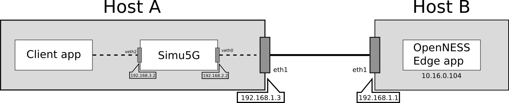
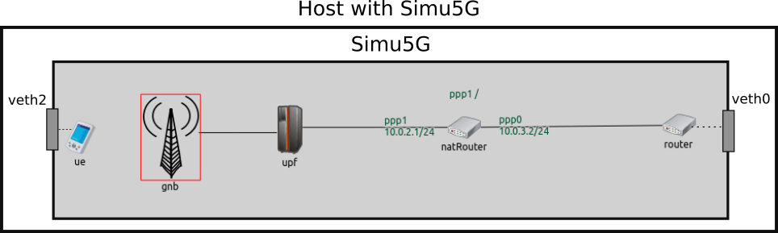
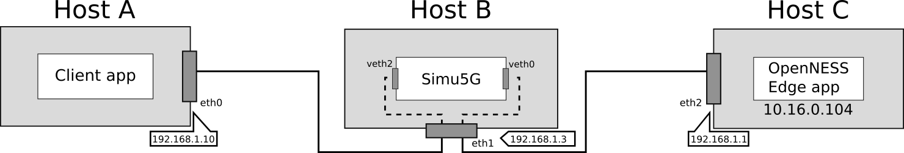

Setting up an emulation with Simu5G and OpenNESS
================================================

| **OpenNESS** is an open-source framework developed by
   **Intel** that allows one to run applications on a real
   Multi-access Edge Computing (MEC) environment. More
   information about the Openness framework can be found on the
   `OpenNESS website <https://www.openness.org/>`__.

This page describes how to setup an emulation scenario where a
(real) client application communicates with a (real) Edge
Application running in the MEC environment provided by
Openness, through a 5G network emulated by Simu5G.

The integration of Simu5G and Openness has been described in
our PIMRC 2020 paper:

-  G. Nardini, G. Stea, A. Virdis, D. Sabella, P. Thakkar,
   "Using Simu5G as a Realtime Network Emulator to Test MEC
   Apps in an End-To-End 5G Testbed", PiMRC 2020, London, UK,
   1-3 September 2020

Emulation scenario
------------------

We refer to a simple video streaming Edge App, which implements
one server instance of the well-known VLC software (note that
the Edge App can be replaced with any other application). The
client application (running on the UE side) is the commercial
version of the VLC media player.
Two scenarios can be deployed:

-  Client application, i.e. the VLC player app, running on the
   `same <#HAB>`__ host where Simu5G runs (if the hardware
   allows it).
-  Client application, i.e. the VLC player appe, running on a
   `different <#HABC>`__ host from where Simu5G runs.

You can refer to the configuration files present in the
*emulation/extclientserver* folder as a starting point for the
emulation.

OpenNESS installation and configuration
---------------------------------------

Please refer to the official `OpenNESS
documentation <https://github.com/open-ness>`__. In this guide,
we refer to Openness v20.06.

Client application on the same host of Simu5G
---------------------------------------------

In the following, we refer to the architecture depicted in
the figure:

The main components of the above architecture are:

-  Host A, which acts as a client and requests a service from
   the OpenNESS server and which also emulates the 5G network
   by running an instance of Simu5G in real-time mode;
-  Host B, which runs an instance of OpenNESS and acts as the
   video-streaming application server.

Host B runs a containeraized Edge App reachable at
10.16.0.104:8080 and the hosts interfaces and IP addresses are
configured as shown in the figure.

Regarding the emulated network scenario, we refer to the
"EmulatedNetwork" example, shown in the figure below.

The router and the UE are endowed with an
*ExtLowerEthernetInterface* module, which is capable to
receive real packets received by a network interface card
attached to it. The latter is virtual and is created as a
`veth <https://man7.org/linux/man-pages/man4/veth.4.html>`__
device. This way, data packets coming to the veth attached to
Simu5G are injected into the "ue" element of the running
instance of it. From there, data are forwarded through the
emulated NR network towards the router. When data packets
reach the router, they are sent out to Edge App via a veth
attached to it. Vice versa, packets coming from the Edge App
are injected into the "router" element of the running
instance of Simu5G and forwarded to the "ue", which sends
them out to the Client application.

The natRouter is used in order to run an emulation in which
both the endpoints of a connection are real applications, so
the **client application needs to use the IP address of the
NAT router within the simulation as destination address**.
Such NAT router element will perform Network Address
Translation (NAT), according to the rules specified with the
corresponding parameter in the INI file.

Setting the environment
~~~~~~~~~~~~~~~~~~~~~~~

In order to setup the above scenario, the following steps are
required to configure the OS on Host A (the one running
Simu5G).

.. note:: The following instructions refer to a host equipped
   with Linux Ubuntu 18.04 OS.

Configure the network
~~~~~~~~~~~~~~~~~~~~~

We need to configure the Host A's OS so that it can reroute
packets from the veth interface connected to Simu5G to the Host
B

#. Enable IP forwarding on Host A, by running "sudo gedit
   /etc/sysctl.conf" from the terminal. Look for the ip_forward
   parameter and edit it as follows:

   .. code:: ini

      net.ipv4.ip_forward=1

#. It could be possible that Host B machine cannot be accessed
   by the user, so the routing table cannot be modified in
   order to add the route for the natRouter (in Simu5G). For
   this reason, Host A performs NAT by changing the natRouter
   source address with the Host A interface address connected
   to Host B.

   .. code:: shell

      sudo iptables -t nat -A POSTROUTING -d 10.16.0.104 -o eth0 -j MASQUERADE
                              sudo iptables-save
                              sudo iptables -L 

#. Add IP route for packets destined to the container running
   the Edge App on Host B:

   .. code:: shell

      sudo route add -net 10.16.0.0/24 via 192.168.1.1 dev eth1

.. note:: routes to inject packet into Simu5G, i.e the veth
   interfaces management, are automatically added by the
   *run_wSocket.sh* script present in the
   *emulation/extclientserver* folder.

Configure the simulation
~~~~~~~~~~~~~~~~~~~~~~~~

The *emulation/extclientserver* folder includes an exemplary
*omnetpp.ini* file. You can use it as a starting point for your
own configuration.

#. In the omnetpp.ini file, set the UE's 'extHostAddress'
   parameter to the IP address of the *veth2* interface

   .. code:: ini

      *.ue.extHostAddress = "192.168.3.2"

#. Configure the routing tables of all the network devices in
   the simulated network. To do so, edit the *.mrt* files
   included in the folder 'routing'. Edit them so as to enable
   a path from the router to the UE. In the *omnetpp.ini* file,
   set the 'routingTable.routingFiles' parameters to the path
   of the *.mrt* files.

#. In the *omnetpp.ini* file, set the 'device' parameters for
   both the router and the UE. It is the name of the virtual
   interfaces which you want to capture the packets

   .. code:: ini

      *.ue.eth[0].device = "veth2"

   .. code:: ini

      *.router.eth[0].device = "veth0"

#. Configure NAT rules:

   -  The destination address known by the client application
      is 10.0.2.1, while the real Edge App address is
      10.16.0.104.
   -  The destination address known by the Edge App is
      10.0.3.2, while the real client application address is
      192.168.3.2 (i.e. the address of the veth2 interface).

   .. code:: ini

      *.router.ipv4.natTable.config = xml("
                  <config> 
                        <entry type='prerouting' 
                           packetDataFilter='*Ipv4Header and destAddress=~10.0.2.1' 
                           srcAddress='10.0.3.2' destAddress='10.16.0.104'> 
                        <entry type='prerouting' 
                           packetDataFilter='*Ipv4Header and destAddress=~10.0.3.2' 
                           srcAddress='10.0.2.1' destAddress='192.168.3.2'> 
                  </config>
                  ") 

Run the scenario
~~~~~~~~~~~~~~~~

.. note:: the INET framework must be compiled with the Network
   Emulation Support feature enabled! To enable it (if not): open
   the OMNeT++ IDE > select the inet projet > Projet tab > select
   Project Features > Network Emulation Support

#. In your terminal, navigate to the "simulations/emulation"
   folder

#. Run the simulation **with root privileges**, by typing:

   .. code:: shell

      sudo ./run_wSocket.sh

   This is needed for running the simulation in real time mode.
   As already mentioned, such script also contains the creation
   and the management of the veth interfaces.

#. Open VLC client > Ctrl-N > enter the network URL as:
   http://10.0.2.1:8080

#. Enjoy the movie coming from a 5G mobile network!

Client application on a different host from where Simu5G runs
-------------------------------------------------------------

| In the following, we refer to the architecture depicted in
   the figure:

The main components of the above architecture are:

-  Host A, which acts as a client and requests a service from
   the OpenNESS server
-  Host B, which emulates the 5G network by running an instance
   of Simu5G in real-time mode
-  Host C, which runs an instance of OpenNESS and acts as the
   video-streaming application server

Host C runs a containeraized Edge App reachable at
10.16.0.104:8080 and the hosts interfaces and IP addresses are
configured as shown in the figure.

Regarding the emulated network scenario, we refer to the
"EmulatedNetwork" example, shown in the figure below.

The router and the UE are endowed with an ExtLowerInterface
module, which is capable to receive real packets received by
a network interface card attached to it. The latter is
virtual and is created as a
`veth <https://man7.org/linux/man-pages/man4/veth.4.html>`__
device. This way, data packets coming to the veth attached to
Simu5G are injected into the "ue" element of the running
instance of. From there, data are forwarded through the
emulated NR network towards the router. When data packets
reach the router, they are sent out to Edge App via a veth
attached to it. Vice versa, packets coming from the Edge App
are injected into the "router" element of the running
instance of Simu5G and forwarded to the "ue", which sends
them out to the Client application.

The natRouter is used in order to run an emulation in which
both the endpoints of a connection are real applications, so
the **client application needs to use the IP address of the
NAT router within the simulation as destination address**.
Such NAT router element will perform Network Address
Translation (NAT), according to the rules specified with the
corresponding parameter in the INI file.

Setting the environment
~~~~~~~~~~~~~~~~~~~~~~~

In order to setup the above scenario, the following steps are
required to configure the OS on Host B (the one running
Simu5G).

.. note:: The following instructions refer to a host equipped
   with Linux Ubuntu 18.04 OS.

Configure the network
~~~~~~~~~~~~~~~~~~~~~

We need to configure the Host B OS so that it can reroute
packets from the veth interfaces connected to Simu5G to Host A
and Host C.

#. Enable IP forwarding on Host B, by running "sudo gedit
   /etc/sysctl.conf" from the terminal. Look for the ip_forward
   parameter and edit it as follows:

   .. code:: ini

      net.ipv4.ip_forward=1

#. It could be possible that Host C machine cannot be accessed
   by the user, so the routing table cannot be modified in
   order to add the route for the natRouter (in Simu5G). For
   this reason, Host B performs NAT by changing the natRouter
   source address with the Host B interface address connected
   to Host C.

   .. code:: shell

      sudo iptables -t nat -A POSTROUTING -d 10.16.0.104 -o eth1 -j MASQUERADE
            sudo iptables-save
            sudo iptables -L
                  

#. Add IP route for packets destined to the container running
   the Edge App on Host C:

   .. code:: shell

      sudo route add -net 10.16.0.0/24 via 192.168.1.1 dev eth1

On Host A

#. Add IP route for packets destined to the natRouter running
   in Simu5G:

   .. code:: shell

      sudo route add -net 10.0.2.0/24 via 192.168.1.3 dev eth0

.. note:: routes to inject packet into Simu5G, i.e the veth
   interfaces management, are automatically added by the
   *run_wSocket.sh* script present in the
   *emulation/extclientserver* folder.

Configure the simulation
~~~~~~~~~~~~~~~~~~~~~~~~

The *emulation/extclientserver* folder includes an exemplary
*omnetpp.ini* file. You can use it as a starting point for your
own configuration.

#. In the omnetpp.ini file, set the UE's 'extHostAddress'
   parameter to the IP address of the Hosta A eth0 interface

   .. code:: ini

      *.ue.extHostAddress = "192.168.1.10"

#. Configure the routing tables of all the network devices in
   the simulated network. To do so, edit the *.mrt* files
   included in the folder 'routing'. Edit them so as to enable
   a path from the router to the UE. In the *omnetpp.ini* file,
   set the 'routingTable.routingFiles' parameters to the path
   of the *.mrt* files.

#. In the *omnetpp.ini* file, set the 'device' parameters for
   both the router and the UE. It is the name of the veth
   interfaces which you want to capture the packets

   .. code:: ini

      *.ue.eth[0].device = "veth2"

   .. code:: ini

      *.router.eth[0].device = "veth0"

#. Configure NAT rules:

   -  The destination address known by the client application
      is 10.0.2.1, while the real Edge App address is
      10.16.0.104.
   -  The destination address known by the Edge App is
      10.0.3.2, while the real client application address is
      192.168.1.10.

   .. code:: ini

         *.router.ipv4.natTable.config = xml("
                  <config> 
                  <entry type='prerouting' 
                        packetDataFilter='*Ipv4Header and destAddress=~10.0.2.1' 
                        srcAddress='10.0.3.2' destAddress='10.16.0.104'> 
                  <entry type='prerouting' 
                        packetDataFilter='*Ipv4Header and destAddress=~10.0.3.2' 
                        srcAddress='10.0.2.1' destAddress='192.168.1.10'> 
                  </config>
               ") 

Run the scenario
~~~~~~~~~~~~~~~~

.. note:: the INET framework must be compiled with the Network
   Emulation Support feature enabled! To enable it (if not): open
   the OMNeT++ IDE > select the inet projet > Projet tab > select
   Project Features > Network Emulation Support > recompile the
   inet project

#. In your terminal, navigate to the "simulations/emulation"
   folder

#. Run the simulation **with root privileges**, by typing:

   .. code:: shell

      sudo ./run_wSocket.sh

   This is needed for running the simulation in real time mode.
   As already mentioned, such script also contains the creation
   and the management of the veth interfaces.

#. Open VLC client on Host A > Ctrl-N > enter the network URL
   as: http://10.0.2.1:8080

#. Enjoy the movie coming from a 5G mobile network!
