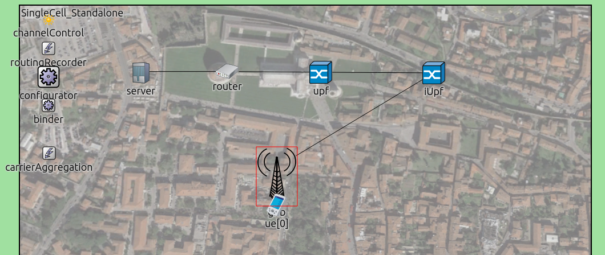

Simu5G Showcase
===============

Goal
----

The goal of this showcase is to demonstrate a standalone 5G network deployment
using the Simu5G framework. It aims to highlight the interactions between
network elements such as the *gNodeB* and the *User Equipment (UE)* in a *5G NR*
environment, and how traffic flows between these elements.

.. versionadded:: 1.2.2

| Source files location: `showcases/NR/standalone <https://github.com/Unipisa/Simu5G/tree/master/showcases/NR/standalone>`__

Model
-----

We use the following network:

The simulation model consists of the following key components:

- **gNodeB**: Represents the 5G base station responsible for communication with the UEs.
- **UE**: Simulates the User Equipment that connects to the network for data transmission.
- **Server**: Acts as the data endpoint for the UEs, simulating internet services.
- **Router and UPF**: Facilitate routing and packet forwarding in the network.

The network is configured to support a standalone 5G NR deployment, as per 3GPP 38.801 specifications.

Configuration
-------------

The simulation is configured via the provided INI file, with the following key settings:

- **Simulation Time**: The simulation runs for a total of 20 seconds.
- **Number of UEs**: Configured to have a single *UE* by default.
- **Mobility**: UEs are confined within a 1000m x 1000m area.
- **Transmission Power**: Configured for both the *gNodeB* and *UE*, with default values set to 40 and 26 respectively.
- **IPv4 Configuration**: Managed by the :ned:`Ipv4NetworkConfigurator` with settings provided in :file:`demo.xml`.

Two traffic configurations are included:

- :ini:`VoIP-DL`: Simulates Voice-over-IP traffic from the server to the *UE*.
- :ini:`VoIP-UL`: Simulates Voice-over-IP traffic from the *UE* to the server.

Results
-------

The simulation generates scalar and vector results captured in :file:`*.sca` and
:file:`*.vec` files, respectively. Key metrics to observe include:

- **End-to-end delay**: Measures the latency experienced by VoIP packets.
- **Throughput**: Assesses the network's capacity to handle data traffic.
- **Packet loss**: Evaluates the reliability of the data transmission.

Analysis of these results can provide insights into the performance and
reliability of the standalone 5G NR deployment in various scenarios.

Conclusion
----------

This showcase provides a comprehensive overview of a standalone 5G network's
operation using the *Simu5G* framework, focusing on the key interactions and
performance metrics essential for evaluating the network's capabilities.

Sources: :download:`omnetpp.ini <../omnetpp.ini>`,
:download:`SingleCell_Standalone.ned <../../../../simulations/NR/networks/SingleCell_Standalone.ned>`

Discussion
----------

Use `this page <https://github.com/Unipisa/Simu5G/discussions/TODO`__ in
the GitHub issue tracker for commenting on this showcase.
